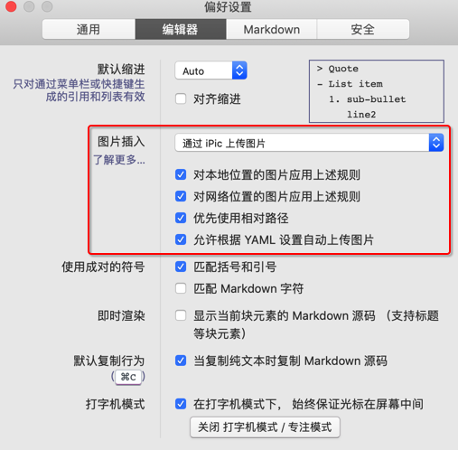
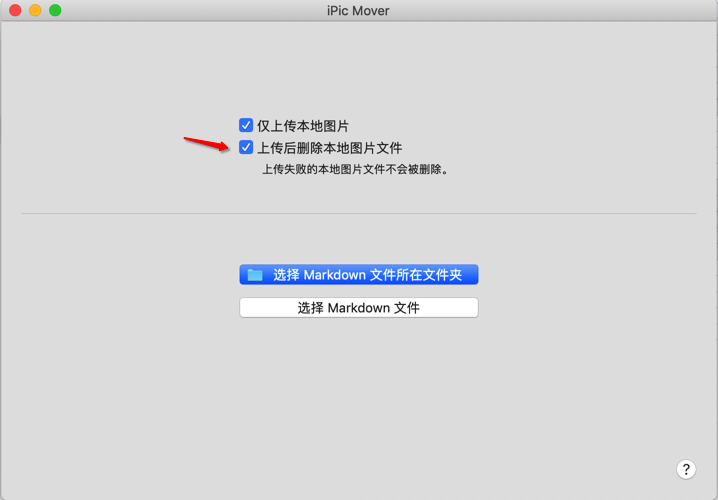

[TOC]

# 1、为什么要用ipic

在本地Typora插入图片的时候能正常显示，但是将编写的文档上传到GitHub上时，不显示了。是因为插入的时候，使用的本地链接路径，生成html文件的时候，img也是该路径，但是我们在本地存储的图片，在网站上是没有能力访问的。如下

# 2、ipic解决方案

## 2.1 下载ipic（仅限mac）

在mac app store中下载，可免费使用所有功能。如需使用其他图床，订阅 iPic 高级版即可。暂不支持 Windows.

## 2.2 偏好设置

你可以在Typora的**偏好设置**中，选择**编辑器**中**图片插入**的**通过iPic上传图片**。最后☑️对本地位置图片应用上述规则和对网络位置的图片应用上述规则。生成的远程链接会自动在插入图片的链接位置中生成，方便快捷。

## 2.3 iPic Mover

[iPic Mover](https://itunes.apple.com/cn/app/id1183822957?ls=1&mt=12) 可以一键将已有 Markdown 文件中所有图片迁移至新图床。批量上传图片、图床搬家，从未如此简单。

这也需要App store中下载，使用之后，之前github不能显示的图片就可以显示了

# 3、参考资料

[iPic - Markdown 图床、文件上传工具]: https://toolinbox.net/iPic/

# 4、上传后删除本地图片

